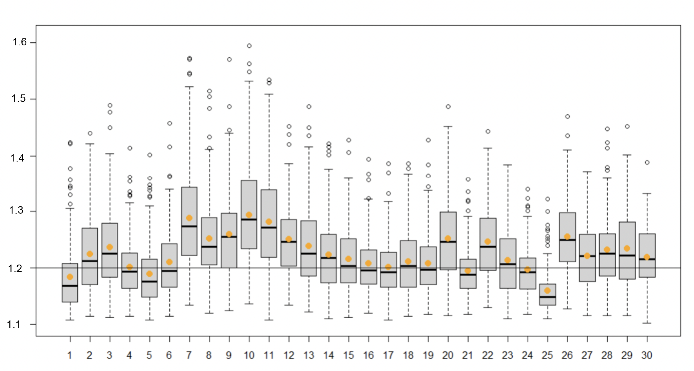

# Bài toán đánh giá và dự đoán khả năng hồi phục của bệnh nhân đột quỵ

## About

Đây là Mini-Project của chương trình Viettel Digital Talent 2020 lĩnh vực Data Science & Artificial Intelligence, tập trung vào xử lý dữ liệu thời gian cho đánh giá quá trình hồi phục y tế. Thông tin về source code theo thứ tự sau:  
[1. Vector Auto-Regressive Mode](https://github.com/TranafLee/VDT-DSAI-2022/blob/main/src/3-VAR.ipynb)  
[2. LightGBM](https://github.com/TranafLee/VDT-DSAI-2022/blob/main/src/5-LightGBM.ipynb)  
[3. Long short-term memory](https://github.com/TranafLee/VDT-DSAI-2022/blob/main/src/7-multivariateLSTM.ipynb)  
[4. SSA-LSTM](https://github.com/TranafLee/VDT-DSAI-2022/blob/main/src/8-SSA-LSTM.ipynb) 

## Contributions

| Contribution List |  |  |
| --- | --- | --- |
| Lê Văn Bằng | Mentor | Propose problem, Review |
| Trần Lê Phương Thảo | Mentee | Data generator, Data analysis, Build Model |

## Problem Definition

- Dựa vào dữ liệu thời gian của các đặc trưng trong môi trường lâm sàng để dự đoán và đánh giá
khả năng hồi phục của bệnh nhân trong tương lai
    - Ưu điểm: trợ giúp nhân viên y tế, không cần sự tham gia của các thiết bị y tế
    - Hạn chế: chỉ áp dụng được cho một số loại bệnh
- Mục tiêu:  
    (1) dự báo số bước và tốc độ đi bộ dựa vào chuỗi thời gian trong quá khứ  
    (2) ước lượng khả năng hồi phục của bệnh nhân trong khoảng thời gian được xác định trong tương lai  
  
Hình 1. Mô tả bài toán

## Dataset

Tập dữ liệu RSPDC (Recovery of Stroke Patient based on Daily-step Counts) bao gồm chuỗi thời gian về số bước đi và tốc độ đi bộ của 31 đối tượng bệnh nhân đột quỵ.

## Data Analysis

1. Data Preprocessing
    - Gap Filling Technique
2. Data Extraction
    - Kiểm định nghiệm đơn vị
    - Kiểm định độ trễ
    - Granger Causality Test
3. Time Series Decomposition
    - Singular Spectrum Analysis (SSA)

## Models Used

1. Vector Auto-Regressive Model (VAR)
2. LightGBM
3. Long short-term memory (LSTM)
4. SSA-LSTM (proposed model)

## Conclusion

**Spatio-Temporal Prediction**

- Kiểm định nghiệm đơn vị, kiểm định độ trễ và Granger Causality Test cần thiết cho việc xây dựng mô hình hồi quy VAR
- Singular Spectrum Analysis (SSA) đóng vai trò quan trọng trong việc cải thiện chất lượng dự đoán của mô hình LSTM  
  
Hình 2. Benchmarch so sánh kết quả của các mô hình dự báo dữ liệu thời gian  
  
Hình 3. Giá trị hàm loss hội tụ sau 100 epochs của mô hình SSA-LSTM

**Exceedance Probability Prediction**

Cách tiếp cận Binary Classification mang lại độ chính xác dự đoán cao  

Hình 4. Boxplot phân bố của giá trị dự đoán và ngưỡng xác định trước

## Future Work

1. Mở rộng thêm các biến dữ liệu thời gian như độ dài trung bình bước đi, nhịp tim trong lúc hoạt động
2. Chuỗi thời gian đếm của biến số bước đi có thể giải quyết vấn đề dự bá nguyên bằng phương pháp Croston
3. Sử dụng lý thuyết và kỹ thuật thống kê trong tiền xử lý như Fourier Transform, Wavelet Transform
4. Sử dụng phương pháp lấy mẫu Boostrap để tính kết quả xác suất trung bình cho cả khoảng thời gian tương lai xác định trước

## Reference
- https://otexts.com/fpp2/
- https://towardsdatascience.com/an-introduction-to-exceedance-probability-forecasting-4c96c0e7772c
- https://www.researchgate.net/publication/352268379_Prediction_of_Financial_Time_Series_Based_on_LSTM_Using_Wavelet_Transform_and_Singular_Spectrum_Analysis
- https://phdinds-aim.github.io/time_series_handbook/Preface/Preface.html
- https://towardsdatascience.com/multi-step-time-series-forecasting-with-arima-lightgbm-and-prophet-cc9e3f95dfb0
- https://github.com/kieferk/pymssa
